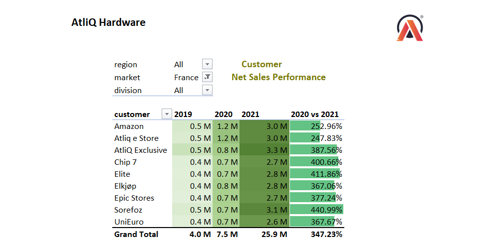
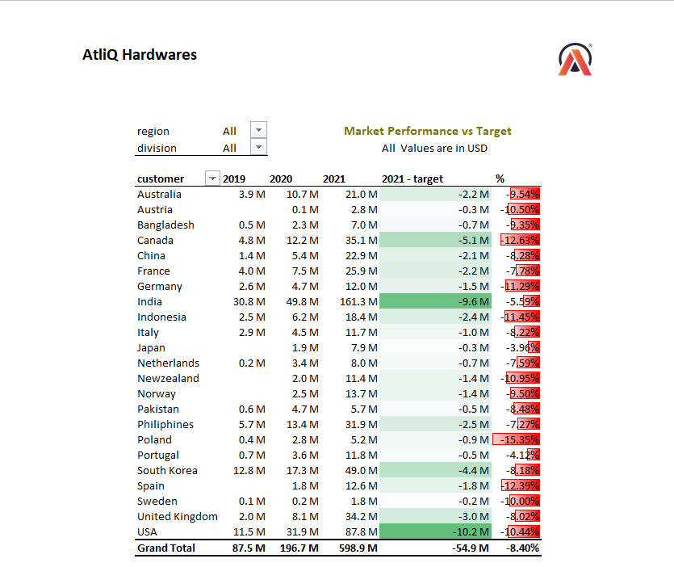
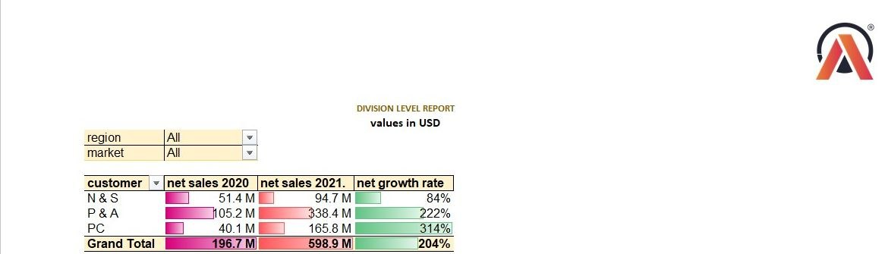
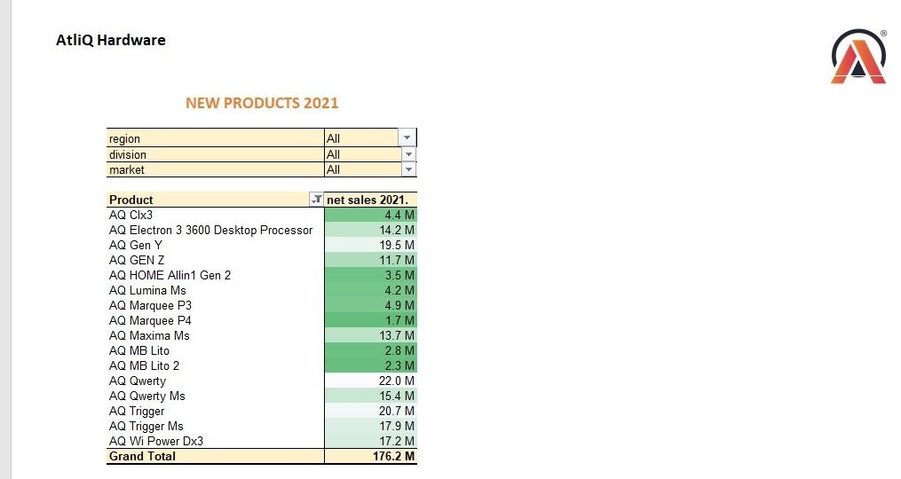
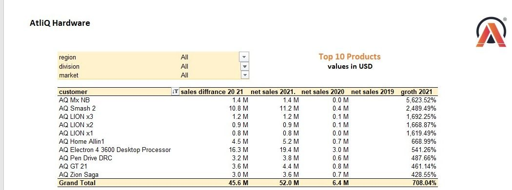
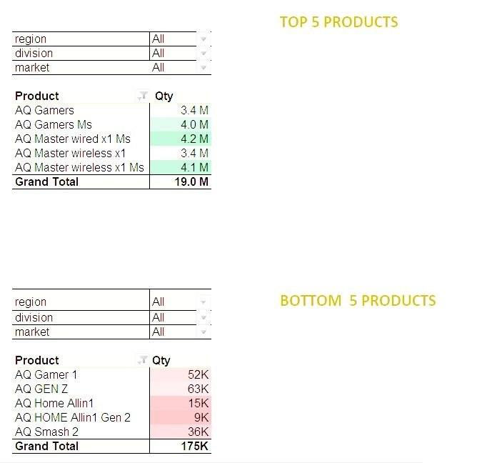

# Excel - Sales and Finance Analytics Project of AtliQ Hardwares

##  Problem Statement

AtliQ Hardwares, a leading hardware company specializing in PCs, printers, mice, and computers with a global reach, faces the challenge of optimizing sales and improving net gross margins.

##  Project Goal

This project focuses on analyzing a vast dataset comprising over half a million records of unorganized sales data, requiring extensive ETL efforts.

The objective is to uncover strategic insights that empower AtliQ Hardwares to make informed decisions and effectively track Key Performance Indicators (KPIs).

The ultimate aim is to drive substantial improvements in the company's performance, centered around net sales and net gross margin.

##  Why This Project Matters

Unlocking the potential within this dataset holds the key to maximizing AtliQ Hardwares' sales and profitability.

By harnessing the power of data analytics, this project transforms business challenges into opportunities and facilitates data-driven decision-making.

The analysis aims to uncover valuable insights within AtliQ Hardwares' sales and finance data, enhancing its global market presence and financial performance.

#  Project Highlights

#  Project Highlights

## Project 1: Sales Analysis and Reporting

### Objective

Developed comprehensive sales analytics reports to evaluate customer, market, and product performance.

### Reports Created
* Customer performance Report
 
* Market Performance vs Target Report
 
* Division-Level Performance Report

* New Products Performance Report for 2021

* Top 10 Products Report

* Top & Bottom 5 Products Performance Report

### Key Achievements

* Enabled effective monitoring and evaluation of customer and market performance.
* Identified sales trends and performance gaps against targets.
* Analyzed product-level performance to identify high-performing and underperforming products.
* Supported data-driven decision-making for customer discounts, product strategy, and market expansion opportunities.

---

## Project 2: Financial Analysis and Reporting

### Objective

Developed comprehensive Profit & Loss (P&L) reports to analyze financial performance across different time periods and markets.

### Reports Created

* P&L Report by Fiscal Year
* P&L Report by Fiscal Months
* P&L Report by Markets

### Key Achievements

* Evaluated financial performance across fiscal years and monthly periods.
* Analyzed market-level profitability and financial trends.
* Supported benchmarking, budgeting, and forecasting processes.
* Enabled stakeholders to gain clear insights into overall financial performance.

#  Technical Skills

- Proficient in ETL methodology (Extract, Transform, Load).
- Skilled in generating date tables using Power Query.
- Experienced in deriving fiscal months and quarters.
- Proficient in establishing data model relationships with Power Pivot.
- Adept at incorporating supplementary data into existing data models.
- Skilled in using DAX to create calculated columns.

#  Soft Skills

- Strong understanding of Sales and Finance Reports.
- Capable of designing user-centric reports.
- Experienced in optimizing report generation through meticulous fine-tuning.
- Skilled in developing a systematic approach to planning and building reports.
